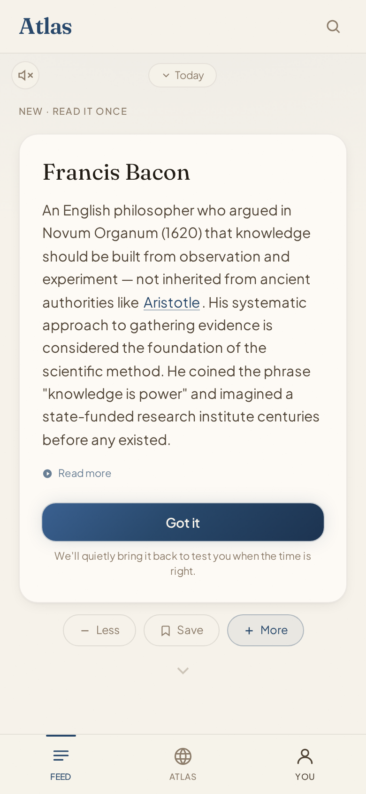
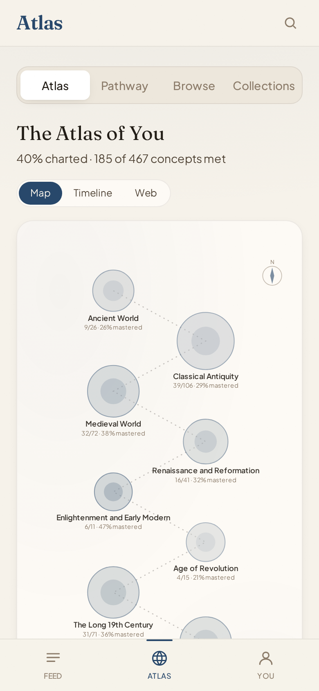
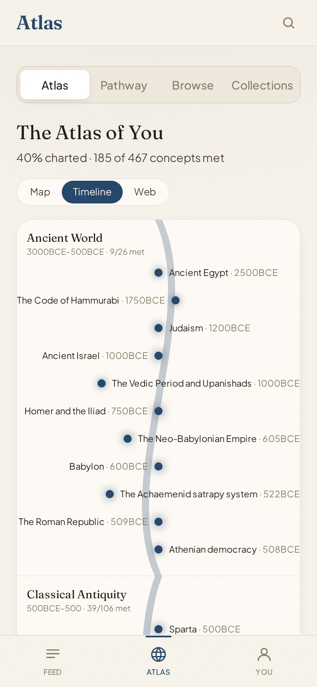

# Atlas

A personal general-knowledge app built on spaced repetition. A few new concepts a
day, then short reviews timed to bring each one back before you forget it.

It covers history, geography, politics, religion, culture and science as one
connected graph. Local-first and offline-capable, with optional cross-device sync
over a small Cloudflare backend.

Live: **https://atlas-6uj.pages.dev**

## Screenshots

| Daily feed | Map | Timeline |
|---|---|---|
|  |  |  |

<sub>Read a concept once, then it comes back as a spaced review. Eras fill in on the map as you learn them, and along the timeline. [Onboarding](docs/screenshots/01-onboarding.png) sets your starting level.</sub>

## Stack

- React + Vite + TypeScript + Tailwind
- Dexie (IndexedDB) for local state; FSRS-6 (`ts-fsrs`) for scheduling
- Cloudflare Workers + D1 for sync, the shared concept bank, and optional AI generation
- Installable PWA (`vite-plugin-pwa`)
- Vitest for tests

## Run

Needs Node 22 (see `.nvmrc`).

```bash
npm install
npm run dev            # http://localhost:5173
```

Local-first: the app seeds its own IndexedDB on first load, so there is no database
to provision and no env vars needed to work on the UI.

## Tests

```bash
npm test               # one-shot
npm run test:watch
npm run type-check     # tsc --noEmit
```

`npm run build` runs the type-check first, so a type error fails the build.

## Deploy

```bash
# App (Cloudflare Pages)
npm run build
npx wrangler pages deploy dist --project-name atlas

# Worker (only when worker/ changed)
cd worker && npx wrangler deploy
```

The service worker caches the previous build, so a deploy takes two loads (or a hard
refresh) to appear.

## Worker configuration

The Worker (`atlas-sync`) binds a D1 database. Every secret is optional and the app
degrades gracefully without it, so a fresh clone still runs:

| Secret | Enables | Without it |
|---|---|---|
| `GEMINI_API_KEY` | pooled AI generation (primary) | `/ai` returns 503, UI offers bring-your-own-key |
| `GROQ_API_KEY` | AI cascade fallback | falls through to 503 |
| `GOOGLE_CLIENT_ID` / `GOOGLE_CLIENT_SECRET` | Google sign-in | sign-in off; anonymous token sync still works |
| `AI_DAILY_CAP` | global daily AI cap (default 500) | uses the default |

Set them with `npx wrangler secret put <NAME>` from `worker/`. See
`worker/.dev.vars.example` for local development. `JWT_SECRET` is declared in the Env
type but unused: session tokens are random ids in the D1 `sessions` table.

## More

- Project orientation and conventions: `CLAUDE.md`
- Design notes: `DESIGN.md`
- Backlog: `TODOS.md`
